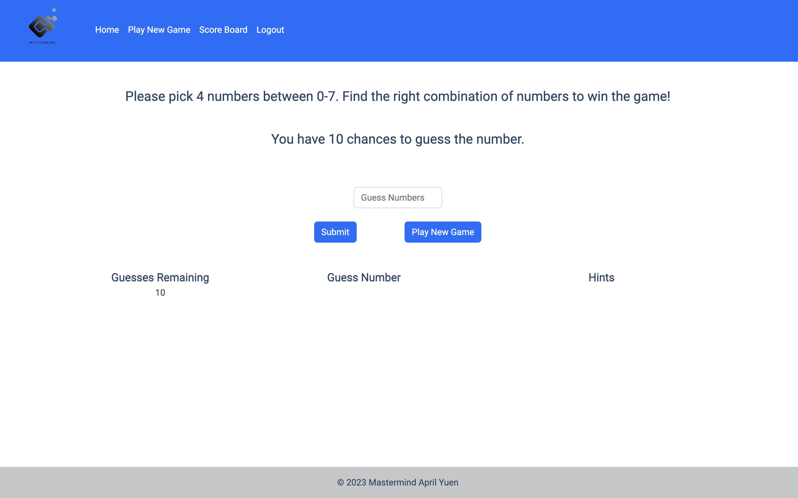

## Mastermind: 

## How To Play:

Users must guess a combination of 4 numbers between 0-7. I used the Random Generator API to generate the 4 digit number combination. Users will be given 10 chances to guess the correct combination of numbers. The user will be shown the number of guesses remaining, the number of correct locations within the combination, and the number of correct digits on the mainGame page. The user will also be shown the guesses they have made.

## How It's Made:

**Tech used:** EJS, CSS, Bootstrap, JavaScript, Node, Express, MongoDB, Passport for Local Authentication 

Throughout the process of building this app, my focus was structuring the code using MVC architecture. This allows for better organization and structure of the code. It also makes debugging easier, and it allows others to better understand my code. Therefore, the views folder contains all of my EJS files that will render the code. 

There is a server.js file that declares the modules, packages, and dependencies I used throughout my application. It also declares the routes I used to set the path for the data that is being created, updated, or read. I have created two different schemas for the models in my database. One is a user schema and the other is a game schema. They are tied together by the user ID. 

The routes folder contains the paths that connect the controller to the views.  It also sets the API endpoints for my application. Finally, I made a controllers folder which contains all the application logic. There are three controllers, one for authorization, game logic, and also a controller for the login page.

Some extensions I have included are local authorization so that the app can keep track of the users, their scores, and games. The users' scores and their usernames are displayed from the highest to the lowest. When the user has won a game, they will also see a confetti package explode.

## 💻 Install

- Fork and clone the repository to your local computer.
- `npm install` to install the required dependencies.
- Complete and store a `.env` file in the `config` folder.
- Create a database in [MongoDB](https://www.mongodb.com/) and connect it to the application by setting the database string to the variable, MONGODB_URI, in the `.env`. 
- Set a port to run the application locally. 
- And, Nodemon is included as a dependency. `npm start` to run the application. 

 

## My Thought Process:

Throughout the process of building this game, I took a lot of time thinking about the logic of the game. My first step was to fetch the correct data from the Random API. Once I had that figured out through Axios in the controller, I was able to create the game logic. 

Since I had to tell the user whether the location and digits they had guessed were correct, I realized I had to use arrays to save the data. Then I would be able to compare the index of the guessed number to the target number by looping through both the target number array and the guessed number array. Then I would be able to increment the location and correct numbers. I was also able to increment the score if the user got all the numbers correct. 

Since I wanted to show the scores of the users, I realized I needed to add authentication to the application. Without authentication, users could take each other’s usernames and the database would be a mess. User authentication provides security for my application and a better user experience. 

To access the guesses and the hints to display for the user, I saved the information as an array when I built the schemas. Then I was able to loop through the data and display it in the views. 
